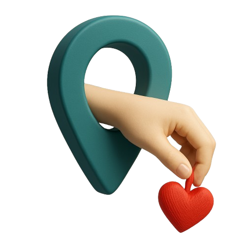
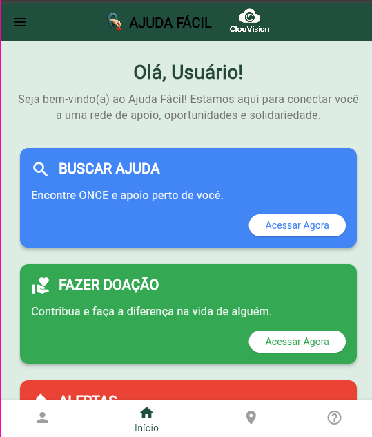
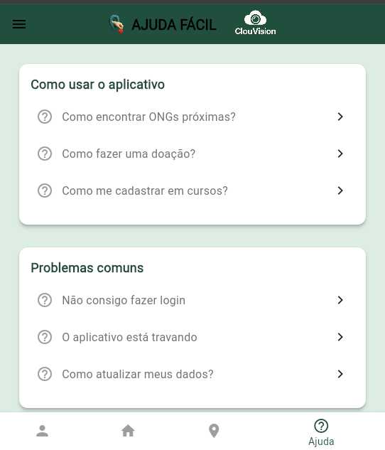
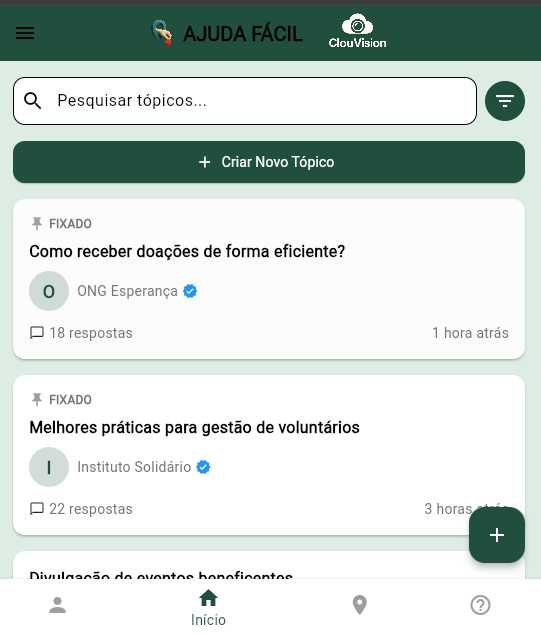

# 🌟 Ajuda Fácil - Projeto Hackathon Unicesumar & Google  
**📌 O projeto se encontra na branch `master`**

  

> ⚠️ **Importante:** O código deste repositório **não realiza chamadas diretas às APIs do Google** sem a chave de autenticação (`key`). Isso evita conflitos durante a compilação do aplicativo.

---

## 📱 Sobre o Projeto

**Ajuda Fácil** é um aplicativo desenvolvido durante o Hackathon Unicesumar em parceria com o Google. O objetivo é conectar pessoas que precisam de ajuda com aquelas dispostas a oferecer apoio, criando uma rede de solidariedade.

- ✨ **Missão:** Facilitar a conexão entre quem precisa e quem pode ajudar  
- 💙 **Valores:** Solidariedade, empatia e ação social  
- 🚀 **Tecnologia:** Desenvolvido com Flutter, visando impacto social

---

## 🎯 Funcionalidades Principais

### 👥 Para Pessoas Físicas (CPF)
- 📌 Solicitar ajuda em diversas categorias (alimentos, roupas, remédios)  
- 📚 Acessar cursos gratuitos de capacitação  
- 💬 Participar de fórum comunitário  
- 🏠 Encontrar instituições próximas que oferecem ajuda  

### 🏛️ Para Instituições (CNPJ)
- 📢 Cadastrar campanhas de arrecadação  
- 📊 Gerenciar doações recebidas  
- 📝 Divulgar vagas para voluntários  
- 🗣️ Interagir com a comunidade através do fórum  

---

## 🛠️ Tecnologias Utilizadas

| Tecnologia    | Descrição                                |
|---------------|------------------------------------------|
| Flutter       | Framework para desenvolvimento multiplataforma |
| Firebase      | Backend e autenticação                   |
| Google Cloud  | Hospedagem e serviços em nuvem           |
| Figma         | Design de interface e prototipação       |

---

## 📸 Capturas de Tela

| Página Inicial | Categorias de Ajuda | Fórum Comunitário |
|----------------|--------------------|-------------------|
|  |  |  |

---

## 👨‍💻 Equipe de Desenvolvimento

Conheça o time por trás do Ajuda Fácil:

- Francilene de Souza  
- Lucas Breno  
- Lucas Lima  
- Andrei Santos

---

## 🌍 Impacto Social

Nosso objetivo é impactar positivamente a vida de milhares de pessoas por meio da tecnologia:

- ✅ +500 pessoas ajudadas na fase de testes  
- ✅ +50 instituições cadastradas  
- ✅ +1.000 itens doados pela plataforma  
- ✅ 100% gratuito para quem precisa e para quem quer ajudar

---

  Desenvolvido com ❤️ durante o Hackathon Unicesumar & Google  
  
  

